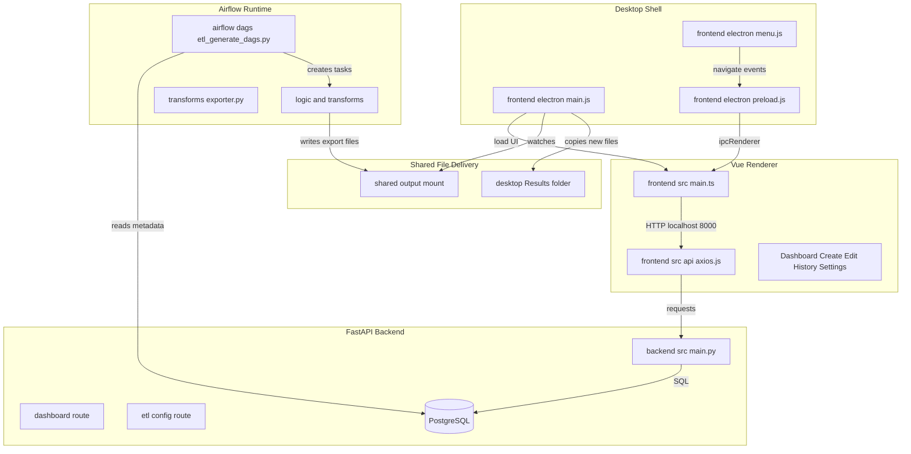
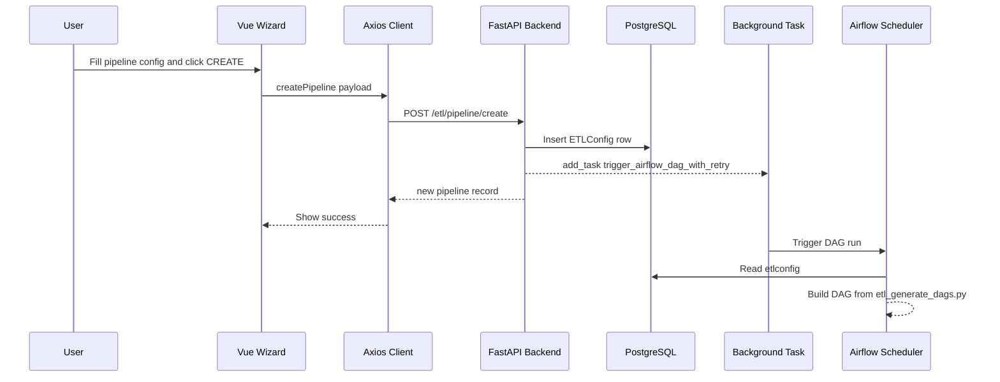
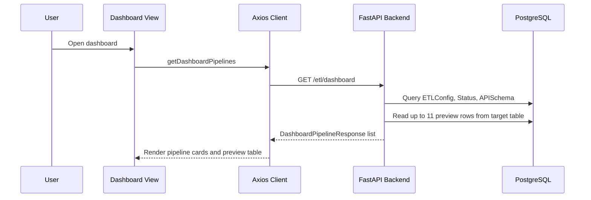
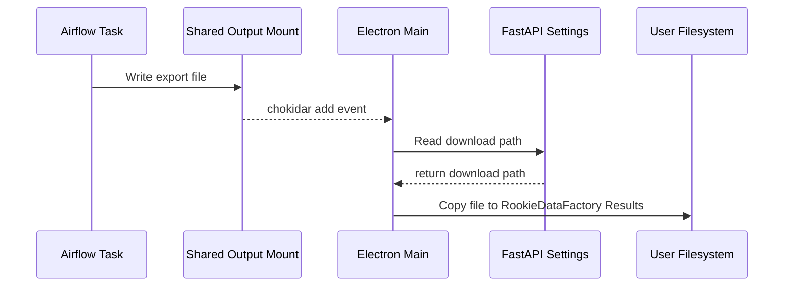
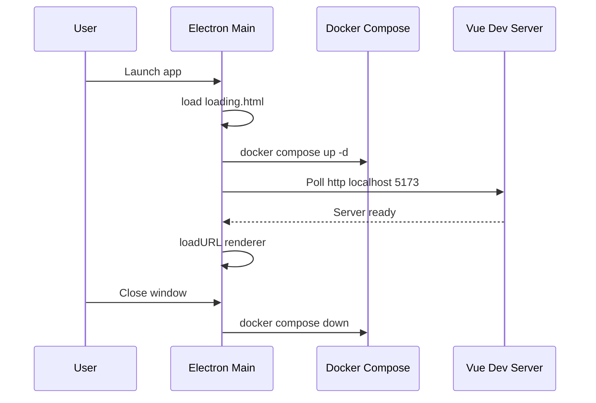

# Service topology and end-to-end request/data flow

# Repository Architecture and Runtime Topology

## Overview

This repository runs as a locally orchestrated ETL system where the desktop shell, Vue renderer, FastAPI backend, PostgreSQL metadata store, and Airflow execution layer all participate in one request-and-file topology. The user works in the Electron-hosted UI, which calls the FastAPI backend on `localhost:8000`; the backend persists pipeline metadata and runtime settings in PostgreSQL; Airflow reads that metadata to materialize DAGs dynamically; and exported files are copied from the shared output mount into the user’s desktop `RookieDataFactory/Results` folder.

At the repository level, `README.md` and `docker-compose.yml` are the operator-facing launch surface for the stack, while the actual runtime wiring is implemented in , , , and . The code in those files defines the service boundaries, the container startup sequence, the HTTP control path, the metadata path, and the local file-delivery path.

## Service Topology and Runtime Boundaries

| Boundary | File anchors | Runtime role | Interface |
| --- | --- | --- | --- |
| Repository launch surface | `README.md`, `docker-compose.yml` | Describes and composes the local stack that the desktop shell starts and stops | Compose-managed containers and shared mounts |
| Desktop shell | , ,  | Starts Docker, hosts the Electron window, bridges menu and IPC actions, and mirrors exported files into the user folder | IPC, local filesystem, `http://localhost:5173` |
| Vue renderer | ,  | Mounts the SPA and sends API requests to the backend | `http://localhost:8000` |
| FastAPI backend | , ,  | Serves ETL metadata APIs and persists pipeline state | HTTP `8000`, PostgreSQL |
| Airflow execution layer | , , ,  | Materializes DAGs from metadata, transforms rows, writes to the target table, and exports files | PostgreSQL, shared output mount |
| Metadata store | PostgreSQL via `DB_URL` | Stores ETL configuration, status, schemas, and system settings | Database connection only |


### Runtime ports and channels

| Service | Port or channel | Evidence in code |
| --- | --- | --- |
| FastAPI backend | `8000` | `backend/Dockerfile` launches `uvicorn src.main:app --host 0.0.0.0 --port 8000` |
| Vue dev server | `5173` |  polls `http://localhost:5173` and loads that URL into the renderer |
| Airflow webserver API | `8080` |  targets `http://airflow-webserver:8080/api/v1` |
| Electron IPC | `navigate`, `dialog:openDirectory`, `create-directories`, `save-file-to-folder` | , ,  |


## Architecture Overview



## Runtime Entry Points

### Frontend HTTP Client

*`frontend/src/api/axios.js`*

This module is the single HTTP client configuration used by the Vue-side API wrappers. Every renderer request goes through this instance, so the backend base URL is fixed at `http://localhost:8000`.

| Property | Type | Description |
| --- | --- | --- |
| `instance.baseURL` | `string` | Points all frontend API calls at the local FastAPI backend |
| `instance.withCredentials` | `boolean` | Enables credentialed requests from the renderer |


### Desktop Host Process

*`frontend/electron/main.js`*

The Electron main process launches the local container stack, waits for the renderer server, manages menu-driven navigation, and moves exported files from the Docker-facing output directory into the user’s desktop results folder.

| Property | Type | Description |
| --- | --- | --- |
| `isDev` | `boolean` | Selects repository root behavior versus packaged executable behavior |
| `PROJECT_ROOT` | `string` | Resolves to the repo root in development or the executable directory in packaged mode |
| `DEBUG_LOG_PATH` | `string` | File path for the Electron debug log next to the app executable or project root |
| `DOCKER_OUT_PATH` | `string` | Path watched for new files from the container side |


| Function | Description |
| --- | --- |
| `logToFile` | Writes a timestamped line to the debug log and console |
| `getDownloadPath` | Reads the configured download path from the backend settings endpoint and follows redirects |
| `createWindow` | Creates the BrowserWindow, starts Docker, waits for the Vue server, and loads the renderer |
| `ipcMain.handle('dialog:openDirectory')` | Opens a directory picker and returns the selected path |
| `ipcMain.handle('create-directories')` | Creates `RookieDataFactory`, `Results`, and `Logs` under the selected base path |
| `ipcMain.handle('save-file-to-folder')` | Writes an arbitrary file payload into a chosen subfolder under `RookieDataFactory` |


The main process also creates a file watcher on `DOCKER_OUT_PATH`. When a new file appears, it resolves the user save location, creates `RookieDataFactory/Results` if needed, and copies the file there.

### Preload Bridge

*`frontend/electron/preload.js`*

The preload script exposes the narrow Electron bridge used by the Vue app.

| Exposed API | Description |
| --- | --- |
| `window.electron.ipcRenderer.on` | Subscribes to IPC messages, including `navigate` |
| `window.electron.ipcRenderer.send` | Sends IPC messages to the main process |
| `window.electron.selectFolder` | Invokes the folder picker channel |
| `window.electron.createDirectories` | Invokes the directory bootstrap channel |
| `window.electron.saveFileToFolder` | Invokes the file-write channel |


### Application Menu Bridge

*`frontend/electron/menu.js`*

The desktop menu sends navigation events into the renderer.

| Menu item | Route sent |
| --- | --- |
| `Home` | `/` |
| `History` | `/history` |
| `Create workflow` | `/create-etl` |
| `Active jobs` | `/active-pipelines` |
| `Help` | `/help` |
| `Settings` | `/settings` |


The renderer listens for `navigate` in  and forwards the route into Vue Router.

### FastAPI Bootstrap

*`backend/src/main.py`*

This file is the backend bootstrap entry point. It initializes SQLAlchemy mappers, creates the FastAPI app, applies middleware, and mounts the routers that expose the runtime APIs.

| Property | Type | Description |
| --- | --- | --- |
| `app` | `FastAPI` | Main backend application instance |
| `etl_config_router` | `APIRouter` | ETL pipeline configuration routes |
| `api_schemas_router` | `APIRouter` | ETL schema discovery routes |
| `dashboard_router` | `APIRouter` | Dashboard routes |
| `history_route.router` | `APIRouter` | History routes |
| `settings_route.router` | `APIRouter` | Settings routes |


| Method | Description |
| --- | --- |
| `read_root` | Returns the root bootstrap payload at `/` |


### Dashboard Response Model

configure_mappers() is called before the FastAPI app is created, so the SQLAlchemy model mappings are initialized during backend startup.

*`backend/src/schemas/dashboard_schema.py`*

`DashboardPipelineResponse` is the typed shape returned by the dashboard list endpoint.

| Property | Type | Description |
| --- | --- | --- |
| `id` | `int` | Pipeline identifier |
| `name` | `str` | Pipeline name shown in the dashboard |
| `lastRun` | `Optional[str]` | Last successful run timestamp as a formatted string |
| `status` | `Optional[str]` | Current pipeline status |
| `nextRun` | `Optional[str]` | Next scheduled run timestamp as a formatted string |
| `source` | `str` | Pipeline source name |
| `alias` | `Optional[str]` | Friendly source alias from the schema table |
| `sampleData` | `List[Dict[str, Any]]` | Preview rows returned from the target table |


`DashboardListResponse` is a type alias for `List[DashboardPipelineResponse]`.

### Airflow DAG Generation

*`airflow/dags/etl_generate_dags.py`*

This module is the dynamic DAG generator. It connects to the metadata database through `DB_URL`, reads pipeline rows from `etlconfig`, and creates one DAG per pipeline. It also resolves timezone settings from `system_settings` and uses them when building the Airflow schedule context.

| Property | Type | Description |
| --- | --- | --- |
| `db_url` | `string` | Database URL read from `DB_URL` |
| `engine` | `Engine` | SQLAlchemy engine created from `db_url` |
| `user_tz_name` | `string` | Time zone name read from `system_settings` or defaulted to `Europe/Budapest` |
| `local_tz` | `pendulum.timezone` | Resolved timezone object |
| `default_args` | `dict` | Airflow default task arguments |


| Function | Description |
| --- | --- |
| `get_user_timezone` | Reads the timezone from `system_settings` and falls back to `Europe/Budapest` |
| `create_dag_structure` | Builds the four-task pipeline DAG and wires task dependencies |


`create_dag_structure` creates these task IDs for each pipeline:

| Task ID pattern | Callable |
| --- | --- |
| `extract_data_{pipeline_id}` | `extract_data` |
| `create_table_{pipeline_id}` | `create_table` |
| `transform_data_{pipeline_id}` | `transform_data` |
| `load_data_{pipeline_id}` | `load_data` |


### Airflow Task Helpers

#### Transformation Helpers

etl_generate_dags.py raises ValueError("Error: Database connection failed.") if DB_URL is missing, so the Airflow image cannot parse the DAG module without database configuration.

*`airflow/plugins/transforms/transfomations.py`*

| Function | Description |
| --- | --- |
| `field_mapping` | Applies rename, delete, concat, and ordering rules to row data |
| `group_by` | Groups row dictionaries by selected columns |
| `flatten_grouped_data` | Flattens grouped data back into a row list |
| `order_by` | Sorts the transformed rows by one or more columns |
| `run_secure_sql_wrapper` | Wraps custom user SQL against the input table and executes it through SQLAlchemy |


#### Load Helpers

*`airflow/plugins/transforms/data_load.py`*

| Function | Description |
| --- | --- |
| `load_append` | Inserts each row into the target table |
| `load_upsert` | Performs `ON CONFLICT` upsert using the first unique column |
| `load_overwrite` | Truncates the target table and appends the new rows |


#### Export Helper

*`airflow/plugins/transforms/exporter.py`*

| Function | Description |
| --- | --- |
| `export_data` | Writes the dataframe to CSV, JSON, Parquet, or Excel in the output directory |


`export_data` chooses its output directory in this order:

| Input | Behavior |
| --- | --- |
| `output_path` provided | Uses that path directly |
| `output_path` missing | Falls back to `airflow/plugins/out/output` relative to the module |


## HTTP Endpoints

#### Get Application Root

```api
{
    "title": "Get Application Root",
    "description": "Returns the backend bootstrap payload from the FastAPI root endpoint",
    "method": "GET",
    "baseUrl": "<FastAPIBackendBaseUrl>",
    "endpoint": "/",
    "headers": [],
    "queryParams": [],
    "pathParams": [],
    "bodyType": "none",
    "requestBody": "",
    "formData": [],
    "rawBody": "",
    "responses": {
        "200": {
            "description": "Success",
            "body": "{\n    \"Hello\": \"ETL BACKEND\"\n}"
        }
    }
}
```

#### Get Dashboard Pipelines

```api
{
    "title": "Get Dashboard Pipelines",
    "description": "Returns the dashboard summary for every pipeline, including status and a preview of sample rows",
    "method": "GET",
    "baseUrl": "<FastAPIBackendBaseUrl>",
    "endpoint": "/etl/dashboard",
    "headers": [],
    "queryParams": [],
    "pathParams": [],
    "bodyType": "none",
    "requestBody": "",
    "formData": [],
    "rawBody": "",
    "responses": {
        "200": {
            "description": "Success",
            "body": "[\n    {\n        \"id\": 12,\n        \"name\": \"Sales Import\",\n        \"lastRun\": \"2026-04-18 10:30\",\n        \"status\": \"success\",\n        \"nextRun\": \"2026-04-19 10:30\",\n        \"source\": \"ApiSettings\",\n        \"alias\": \"Sales API\",\n        \"sampleData\": [\n            {\n                \"customer_id\": 1001,\n                \"order_total\": 145.5,\n                \"created_at\": \"2026-04-18T10:25:00\"\n            }\n        ]\n    }\n]"
        }
    }
}
```

#### Get Pipeline Full Data

```api
{
    "title": "Get Pipeline Full Data",
    "description": "Returns the complete row set for a single pipeline target table",
    "method": "GET",
    "baseUrl": "<FastAPIBackendBaseUrl>",
    "endpoint": "/etl/dashboard/pipeline/{pipeline_id}/data",
    "headers": [],
    "queryParams": [],
    "pathParams": [
        {
            "name": "pipeline_id",
            "type": "int",
            "description": "Pipeline identifier"
        }
    ],
    "bodyType": "none",
    "requestBody": "",
    "formData": [],
    "rawBody": "",
    "responses": {
        "200": {
            "description": "Success",
            "body": "{\n    \"data\": [\n        {\n            \"customer_id\": 1001,\n            \"order_total\": 145.5,\n            \"created_at\": \"2026-04-18T10:25:00\"\n        }\n    ]\n}"
        }
    }
}
```

#### Create Pipeline

```api
{
    "title": "Create Pipeline",
    "description": "Persists a new ETL pipeline configuration, generates the initial metadata, and schedules the Airflow trigger as a background task",
    "method": "POST",
    "baseUrl": "<FastAPIBackendBaseUrl>",
    "endpoint": "/etl/pipeline/create",
    "headers": [
        {
            "key": "Content-Type",
            "value": "application/json",
            "required": true
        }
    ],
    "queryParams": [],
    "pathParams": [],
    "bodyType": "json",
    "requestBody": "{\n    \"pipeline_name\": \"Sales Import\",\n    \"source\": \"ApiSettings\",\n    \"schedule\": \"daily\",\n    \"custom_time\": \"10:30\",\n    \"dependency_pipeline_id\": 8,\n    \"parameters\": {\n        \"base_url\": \"https://api.example.com\",\n        \"endpoint\": \"/orders\",\n        \"extra_file_path\": \"/opt/backend/src/shared_uploads/orders.csv\",\n        \"extra_file_columns\": [\n            \"customer_id\",\n            \"order_total\"\n        ],\n        \"dependency_columns\": [\n            \"customer_id\"\n        ]\n    },\n    \"field_mappings\": {\n        \"customer_id\": {\n            \"rename\": false,\n            \"newName\": \"\",\n            \"unique\": true,\n            \"delete\": false,\n            \"concat\": {\n                \"enabled\": false,\n                \"with\": \"\",\n                \"separator\": \" \"\n            }\n        },\n        \"order_total\": {\n            \"rename\": false,\n            \"newName\": \"\",\n            \"unique\": false,\n            \"delete\": false,\n            \"concat\": {\n                \"enabled\": false,\n                \"with\": \"\",\n                \"separator\": \" \"\n            }\n        }\n    },\n    \"column_order\": [\n        \"customer_id\",\n        \"order_total\"\n    ],\n    \"group_by_columns\": [\n        \"customer_id\"\n    ],\n    \"order_by_column\": \"customer_id\",\n    \"order_direction\": \"asc\",\n    \"custom_sql\": null,\n    \"update_mode\": \"upsert\",\n    \"save_option\": \"createfile\",\n    \"file_format\": \"csv\"\n}",
    "formData": [],
    "rawBody": "",
    "responses": {
        "200": {
            "description": "Success",
            "body": "{\n    \"id\": 12,\n    \"pipeline_name\": \"Sales Import\",\n    \"source\": \"ApiSettings\",\n    \"version\": 1,\n    \"target_table_name\": \"sales_import_v1\",\n    \"dag_id\": \"etl_generated_12_sales_import\",\n    \"schedule\": \"daily\",\n    \"custom_time\": \"10:30\",\n    \"dependency_pipeline_id\": 8,\n    \"parameters\": {\n        \"base_url\": \"https://api.example.com\",\n        \"endpoint\": \"/orders\",\n        \"extra_file_path\": \"/opt/backend/src/shared_uploads/orders.csv\",\n        \"extra_file_columns\": [\n            \"customer_id\",\n            \"order_total\"\n        ],\n        \"dependency_columns\": [\n            \"customer_id\"\n        ]\n    },\n    \"field_mappings\": {\n        \"customer_id\": {\n            \"rename\": false,\n            \"newName\": \"\",\n            \"unique\": true,\n            \"delete\": false,\n            \"concat\": {\n                \"enabled\": false,\n                \"with\": \"\",\n                \"separator\": \" \"\n            }\n        },\n        \"order_total\": {\n            \"rename\": false,\n            \"newName\": \"\",\n            \"unique\": false,\n            \"delete\": false,\n            \"concat\": {\n                \"enabled\": false,\n                \"with\": \"\",\n                \"separator\": \" \"\n            }\n        }\n    },\n    \"column_order\": [\n        \"customer_id\",\n        \"order_total\"\n    ],\n    \"group_by_columns\": [\n        \"customer_id\"\n    ],\n    \"order_by_column\": \"customer_id\",\n    \"order_direction\": \"asc\",\n    \"custom_sql\": null,\n    \"update_mode\": \"upsert\",\n    \"save_option\": \"createfile\",\n    \"file_format\": \"csv\"\n}"
        }
    }
}
```

## Feature Flows

### Pipeline Creation and DAG Materialization



export_data defaults to Path(__file__).parent.parent / "out" / "output", while  watches PROJECT_ROOT/output. The desktop copy flow depends on the runtime volume mapping those locations to the same shared directory.

1. The Vue wizard submits a merged payload from the Pinia store.
2. routes the request into `etl_config_router`.
3. `create_pipeline` filters accepted fields, generates `target_table_name` and `dag_id`, commits `ETLConfig`, and returns the new record immediately.
4. `background_tasks.add_task(trigger_airflow_dag_with_retry, new_pipeline.dag_id)` starts the Airflow side without blocking the response.
5. reads `etlconfig` and creates the pipeline DAG and its task chain.

### Dashboard Read Flow



The same dashboard view opens a full-data modal by requesting the per-pipeline data endpoint.

### Exported File Delivery



1. Airflow task code writes the generated file into the shared output directory.
2. watches that directory with `chokidar`.
3. On file add, Electron asks the backend for the current download path.
4. Electron ensures `RookieDataFactory/Results` exists under the chosen base path.
5. The new file is copied into that Results folder for desktop access.

### Desktop Startup and Shutdown



The Electron shell owns the container lifecycle in this runtime path. It starts the stack, loads a waiting screen, swaps to the renderer once the Vue server is reachable, and tears the stack down when the window closes.

## State Management

### Metadata-Backed Pipeline State

The canonical pipeline state is stored in PostgreSQL and rehydrated on demand by both the backend and Airflow.

| State surface | Backing source | Runtime use |
| --- | --- | --- |
| Pipeline configuration | `ETLConfig` rows | Read by the dashboard, create flow, and DAG generator |
| Execution status | `Status` rows | Displayed on the dashboard summary |
| Source schema metadata | `APISchema` rows | Used for alias display and field discovery |
| System settings | `system_settings` rows | Used to resolve timezone and save path behavior |


### Renderer and Desktop State

| State surface | Runtime owner | Behavior |
| --- | --- | --- |
| Wizard configuration | Vue Pinia store | Passed into `createPipeline` and `updatePipeline` payloads |
| Active Electron window | Electron main process | Controls loading screen, app lifecycle, and IPC |
| Results folder path | User-selected local path | Used by the copy step after an export file appears |


## Error Handling

| Location | Failure path | Runtime effect |
| --- | --- | --- |
|  | Application startup before routes are served | `configure_mappers()` and router setup run during boot; failures stop the backend from starting |
|  | Any exception during pipeline creation | Database transaction is rolled back and `HTTPException(status_code=500)` is raised |
|  | Target-table read failure | Dashboard preview falls back to empty sample data |
|  | Missing `DB_URL` | DAG parsing aborts with a `ValueError` |
|  | Docker or file copy failure | Error is written to the debug log and console |
|  | Output write failure | The exception is printed during export |
|  | Upsert or insert mismatch | The load helper logs warnings or fails on the SQL execution path |


## Dependencies

| Dependency | Where it is used | Role in topology |
| --- | --- | --- |
| `FastAPI` |  | HTTP backend runtime |
| `SQLAlchemy` | , , `airflow/plugins/...` | ORM and SQL execution layer |
| `psycopg2-binary` | Backend and Airflow requirements | PostgreSQL driver |
| `pandas` | Dashboard preview, extract/load/transforms, export | Data shaping and table previews |
| `requests` |  | HTTP client to Airflow REST API |
| `uvicorn` | Backend Docker startup | ASGI server for FastAPI |
| `python-multipart` | Backend upload flow | File upload support |
| `vue`, `vue-router`, `pinia` | Frontend renderer | UI, routing, and wizard state |
| `axios` |  | Renderer HTTP client |
| `electron` |  | Desktop shell and IPC |
| `chokidar` |  | Watches the shared output directory |
| `apache-airflow-providers-postgres`, `apache-airflow`, `pendulum` | Airflow runtime | DAG execution and timezone resolution |


### Backend to Airflow API boundary

*`backend/src/common/airflow_client.py`*

| Constant | Value | Role |
| --- | --- | --- |
| `AIRFLOW_URL` | `http://airflow-webserver:8080/api/v1` | REST API base used by backend-to-Airflow calls |
| `USERNAME` | `admin` | Airflow API username |
| `PASSWORD` | `admin` | Airflow API password |
| `AUTH` | `HTTPBasicAuth(USERNAME, PASSWORD)` | Auth object passed to Airflow requests |


## Key Classes Reference

| Class | Responsibility |
| --- | --- |
| `main.py` | Boots FastAPI, applies middleware, and mounts the runtime routers |
| `dashboard_schema.py` | Defines the typed dashboard response shape returned to the renderer |
| `etl_generate_dags.py` | Builds Airflow DAGs dynamically from metadata rows |
| `main.js` | Starts Docker, hosts the Electron shell, and moves exported files into Results |
| `preload.js` | Exposes the renderer-safe Electron IPC bridge |
| `axios.js` | Configures the renderer HTTP client for the backend base URL |
| `exporter.py` | Writes Airflow export files into the shared output path |
| `data_load.py` | Persists transformed rows into the target table |
| `transfomations.py` | Applies row-level field mapping, grouping, ordering, and SQL wrapping |


---
Source: https://app.docuwriter.ai/space/45528/item/548677